# Dance Website - Visual ERD (Mermaid)

## Entity Relationship Diagram

```mermaid
erDiagram
    USERS {
        bigint id PK
        varchar email UK
        varchar password_hash
        varchar full_name
        varchar phone
        varchar dance_style
        varchar skill_level
        text bio
        varchar profile_image
        boolean is_verified
        json preferences
        timestamp created_at
        timestamp updated_at
    }

    ADMINS {
        bigint id PK
        varchar email UK
        varchar password_hash
        varchar username UK
        varchar role
        timestamp created_at
        timestamp updated_at
        timestamp last_login
        boolean is_active
    }

    INSTRUCTORS {
        bigint id PK
        varchar name
        varchar specialty
        text bio
        varchar image_url
        varchar experience
        json social_links
        decimal rating
        boolean is_active
        timestamp created_at
        timestamp updated_at
    }

    CLASSES {
        bigint id PK
        varchar title
        text description
        varchar level
        varchar dance_style
        int duration
        int max_capacity
        decimal price
        json schedule_days
        time schedule_time
        text requirements
        varchar image_url
        boolean is_active
        timestamp created_at
        timestamp updated_at
    }

    EVENTS {
        bigint id PK
        varchar title
        text description
        varchar event_type
        date start_date
        date end_date
        time start_time
        time end_time
        varchar location
        text address
        decimal price
        int max_attendees
        int current_attendees
        varchar image_url
        varchar organizer
        json tags
        decimal rating
        varchar status
        boolean is_featured
        timestamp created_at
        timestamp updated_at
    }

    CLASS_INSTRUCTORS {
        bigint id PK
        bigint class_id FK
        bigint instructor_id FK
        boolean is_primary
        timestamp created_at
    }

    CLASS_BOOKINGS {
        bigint id PK
        bigint user_id FK
        bigint class_id FK
        timestamp booking_date
        varchar status
        varchar payment_status
        decimal amount_paid
        varchar payment_method
        text notes
        timestamp created_at
        timestamp updated_at
    }

    EVENT_BOOKINGS {
        bigint id PK
        bigint user_id FK
        bigint event_id FK
        timestamp booking_date
        varchar status
        varchar payment_status
        decimal amount_paid
        varchar payment_method
        text notes
        timestamp created_at
        timestamp updated_at
    }

    CONTACT_MESSAGES {
        bigint id PK
        varchar name
        varchar email
        varchar phone
        text message
        varchar subject
        boolean is_read
        text admin_response
        timestamp created_at
        timestamp updated_at
    }

    PARTNER_REQUESTS {
        bigint id PK
        bigint requester_id FK
        varchar dance_style
        varchar skill_level
        varchar location
        json availability
        text message
        varchar status
        timestamp created_at
        timestamp updated_at
    }

    PARTNER_MATCHES {
        bigint id PK
        bigint user1_id FK
        bigint user2_id FK
        decimal match_score
        varchar status
        timestamp created_at
        timestamp updated_at
    }

    TESTIMONIALS {
        bigint id PK
        bigint user_id FK
        decimal rating
        text message
        boolean is_featured
        boolean is_approved
        timestamp created_at
        timestamp updated_at
    }

    DANCE_STYLES {
        bigint id PK
        varchar name
        text description
        varchar image_url
        varchar difficulty_level
        int popularity
        varchar category
        boolean is_active
        timestamp created_at
        timestamp updated_at
    }

    NEWSLETTERS {
        bigint id PK
        varchar email
        varchar name
        boolean is_subscribed
        json preferences
        timestamp subscribed_at
        timestamp unsubscribed_at
        timestamp created_at
        timestamp updated_at
    }

    NOTIFICATIONS {
        bigint id PK
        bigint user_id FK
        varchar type
        varchar title
        text message
        boolean is_read
        varchar priority
        varchar action_url
        timestamp created_at
    }

    FORUM_POSTS {
        bigint id PK
        bigint user_id FK
        varchar category
        varchar title
        text content
        json tags
        int views_count
        int likes_count
        int replies_count
        boolean is_pinned
        boolean is_locked
        timestamp created_at
        timestamp updated_at
    }

    FORUM_REPLIES {
        bigint id PK
        bigint post_id FK
        bigint user_id FK
        bigint parent_id FK
        text content
        int likes_count
        boolean is_solution
        timestamp created_at
        timestamp updated_at
    }

    AUDIT_LOGS {
        bigint id PK
        bigint user_id FK
        bigint admin_id FK
        varchar action
        varchar table_name
        bigint record_id
        json old_values
        json new_values
        varchar ip_address
        varchar user_agent
        timestamp created_at
    }

    SETTINGS {
        bigint id PK
        varchar key
        text value
        varchar type
        text description
        boolean is_public
        timestamp created_at
        timestamp updated_at
    }

    USER_DASHBOARDS {
        bigint id PK
        bigint user_id FK
        varchar title
        json layout_config
        varchar theme
        boolean is_default
        varchar visibility
        timestamp last_accessed
        timestamp created_at
        timestamp updated_at
    }

    DASHBOARD_WIDGETS {
        bigint id PK
        bigint dashboard_id FK
        varchar widget_type
        int position_x
        int position_y
        int width
        int height
        json settings
        varchar title
        boolean is_visible
        timestamp created_at
        timestamp updated_at
    }

    USER_ANALYTICS {
        bigint id PK
        bigint user_id FK
        int login_count
        int class_bookings
        int event_bookings
        decimal total_spent
        int forum_posts
        int forum_replies
        int partner_requests
        decimal avg_class_rating
        timestamp last_login
        int streak_days
        timestamp created_at
        timestamp updated_at
    }

    USER_GOALS {
        bigint id PK
        bigint user_id FK
        varchar title
        text description
        varchar goal_type
        int target_value
        int current_value
        date start_date
        date end_date
        varchar priority
        varchar status
        timestamp created_at
        timestamp updated_at
    }

    USER_ACTIVITY_LOG {
        bigint id PK
        bigint user_id FK
        varchar activity_type
        varchar entity_type
        bigint entity_id
        varchar action
        json details
        varchar ip_address
        varchar user_agent
        timestamp created_at
    }

    DASHBOARD_LAYOUTS {
        bigint id PK
        varchar name
        text description
        json template
        int columns
        boolean is_default
        boolean is_active
        timestamp created_at
        timestamp updated_at
    }

    %% Relationships
    USERS ||--o{ CLASS_BOOKINGS : books
    USERS ||--o{ EVENT_BOOKINGS : books
    USERS ||--o{ PARTNER_REQUESTS : creates
    USERS ||--o{ TESTIMONIALS : writes
    USERS ||--o{ NOTIFICATIONS : receives
    USERS ||--o{ FORUM_POSTS : creates
    USERS ||--o{ FORUM_REPLIES : writes
    USERS ||--o{ AUDIT_LOGS : performs
    
    CLASSES ||--o{ CLASS_BOOKINGS : has
    CLASSES ||--o{ CLASS_INSTRUCTORS : taught_by
    
    EVENTS ||--o{ EVENT_BOOKINGS : has
    
    INSTRUCTORS ||--o{ CLASS_INSTRUCTORS : teaches
    
    FORUM_POSTS ||--o{ FORUM_REPLIES : has
    FORUM_REPLIES ||--o{ FORUM_REPLIES : nested_in
    
    ADMINS ||--o{ AUDIT_LOGS : performs
    
    USERS ||--o{ PARTNER_MATCHES : user1
    USERS ||--o{ PARTNER_MATCHES : user2
    
    USERS ||--o{ USER_DASHBOARDS : owns
    USERS ||--|| USER_ANALYTICS : has
    USERS ||--o{ USER_GOALS : sets
    USERS ||--o{ USER_ACTIVITY_LOG : performs
    
    USER_DASHBOARDS ||--o{ DASHBOARD_WIDGETS : contains
```

## Database Schema Overview

### Core Business Entities
1. **Users & Authentication**
   - `USERS` - Regular website users
   - `ADMINS` - Administrative users with elevated permissions

2. **Content Management**
   - `INSTRUCTORS` - Dance instructors
   - `CLASSES` - Regular dance classes
   - `EVENTS` - Special events and workshops
   - `DANCE_STYLES` - Available dance styles

3. **Booking System**
   - `CLASS_BOOKINGS` - Class registrations
   - `EVENT_BOOKINGS` - Event registrations

4. **Partner Matching**
   - `PARTNER_REQUESTS` - User requests for dance partners
   - `PARTNER_MATCHES` - AI-generated partner matches

5. **Community Features**
   - `FORUM_POSTS` - Community discussion posts
   - `FORUM_REPLIES` - Threaded replies to posts
   - `TESTIMONIALS` - User reviews and testimonials

6. **Communication**
   - `CONTACT_MESSAGES` - Contact form submissions
   - `NEWSLETTERS` - Newsletter subscriptions
   - `NOTIFICATIONS` - User notifications

7. **System Management**
   - `AUDIT_LOGS` - System audit trail
   - `SETTINGS` - Application settings

### Key Features Supported

#### 1. User Management
- User registration and authentication
- Profile management with dance preferences
- Role-based access control

#### 2. Class & Event Management
- Instructors can be assigned to multiple classes
- Booking system with capacity management
- Payment tracking and status management

#### 3. Partner Matching System
- Users can request dance partners
- AI-powered matching based on preferences
- Match scoring and status tracking

#### 4. Community Platform
- Threaded forum discussions
- User testimonials and reviews
- Notification system

#### 5. Admin Dashboard
- Complete CRUD operations on all entities
- Audit logging for compliance
- Contact message management
- User and booking analytics

### Indexing Strategy
- Primary keys on all tables
- Foreign key indexes for joins
- Email indexes for authentication
- Search indexes on text fields
- Composite indexes for common queries

This ERD provides a comprehensive foundation for the dance website's backend system with admin panel capabilities.
